# Backend Flow Diagrams - Daily Wealth System

## 1. Overall Architecture Flow

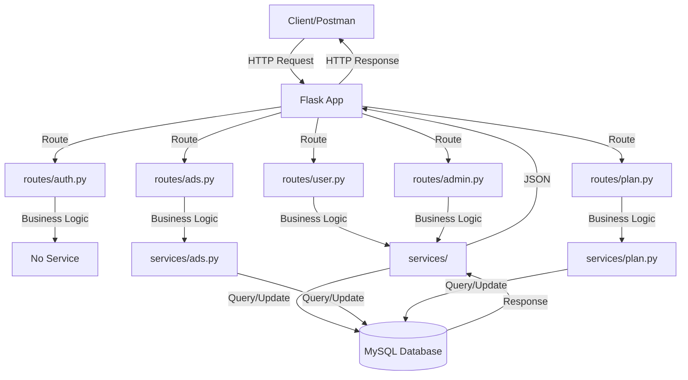

---

## 2. Request Processing Flow

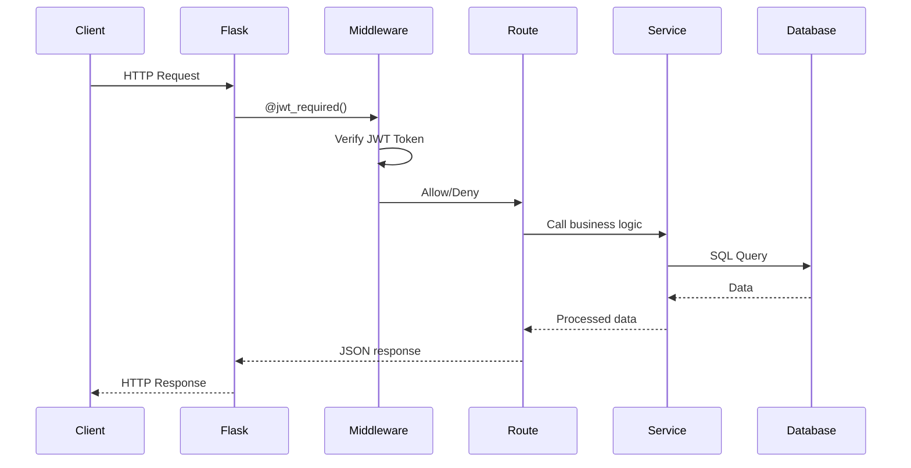

---

## 3. User Registration Flow

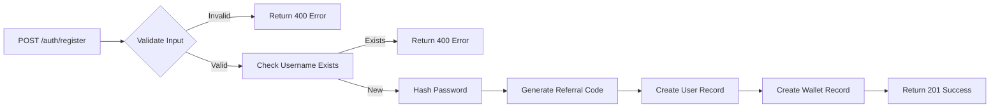

---

## 4. Plan Purchase & Activation Flow

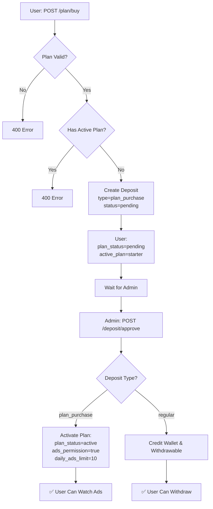

---

## 5. Admin Plan Management Flow

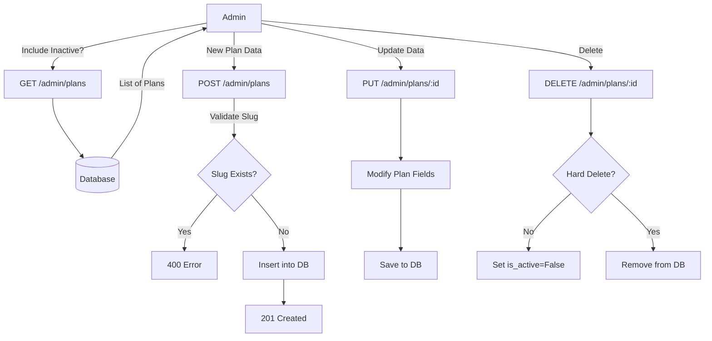

---

## 6. Ad Watching Flow

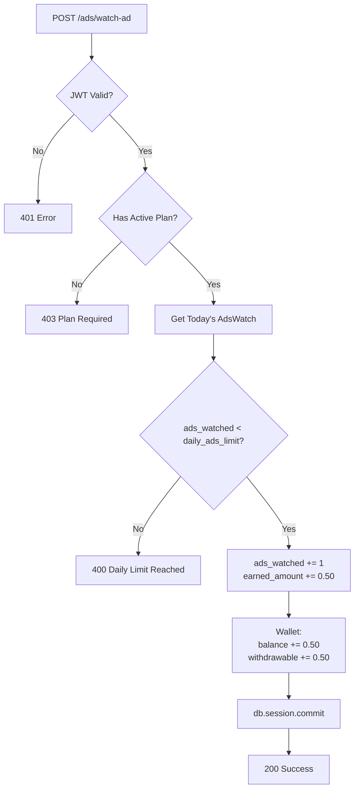

---

## 7. Withdrawal Flow

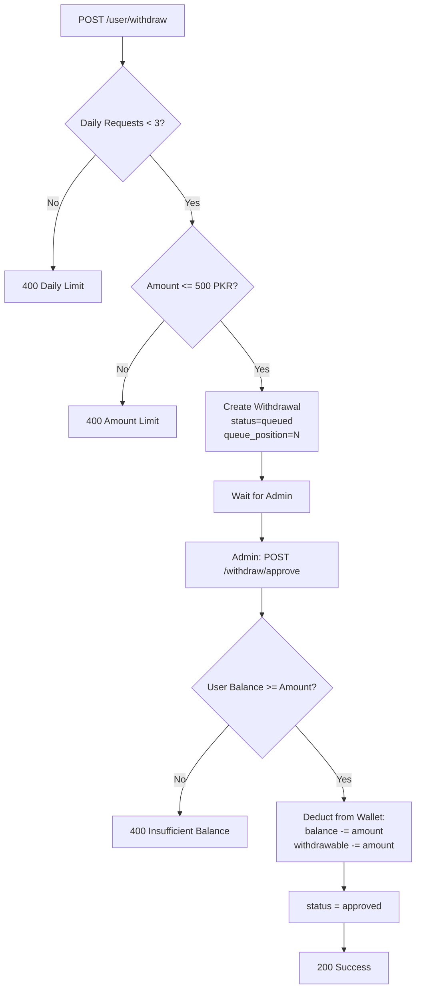

---

## 8. Deposit & Commission Flow

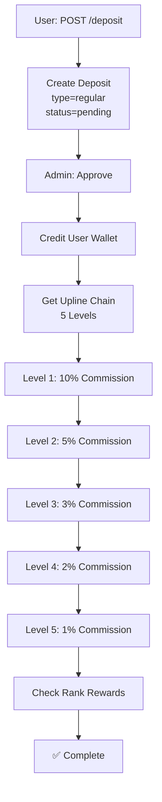

---

## 9. Daily Ad Reset Mechanism

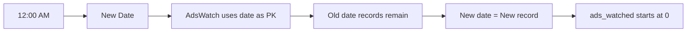

---

## 10. Database Schema Relationships

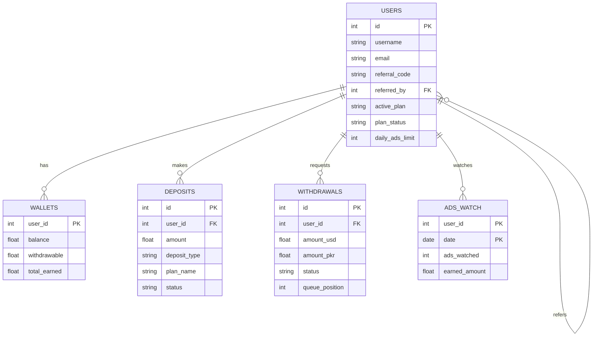

---

## 11. Complete User Journey Flow

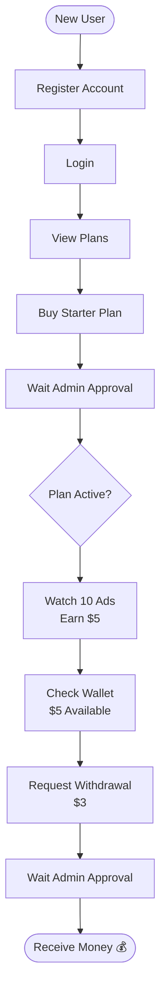

---

## File Structure

```
Dailywealthby-sajid-main/
├── app.py                 # Main Flask application
├── config.py             # Configuration (Plans, Limits, etc.)
├── models/
│   ├── user.py           # User model
│   ├── wallet.py         # Wallet model
│   ├── deposit.py        # Deposit model
│   ├── withdrawal.py     # Withdrawal model
│   ├── ads_watch.py      # AdsWatch model
│   └── plan.py           # Plan model (Dynamic Plans)
├── routes/
│   ├── auth.py           # Auth routes
│   ├── user.py           # User routes (deposit, withdraw, wallet)
│   ├── admin.py          # Admin routes
│   ├── ads.py            # Ad watching routes
│   └── plan.py           # Plan purchase routes
├── services/
│   ├── ads.py            # Ad watching logic
│   ├── plan.py           # Plan activation logic
│   ├── plan_admin.py     # Plan CRUD logic
│   ├── deposit.py        # Deposit approval logic
│   ├── withdrawal.py     # Withdrawal processing
│   ├── wallet.py         # Wallet operations
│   └── referral.py       # Commission calculations
└── middleware/
    ├── jwt_required.py   # JWT & Plan decorators
    ├── logging.py        # Request logging
    └── rate_limiting.py  # Rate limiting
```
