# Backend Flow Diagrams - Daily Wealth System

## 1. Overall Architecture Flow


---

## 2. Request Processing Flow


---

## 3. User Registration Flow


---

## 4. Plan Purchase & Activation Flow

```mermaid
graph TB
    Start[User: POST /plan/buy] --> ValidatePlan{Plan Valid?}
    ValidatePlan -->|No| Error1[400 Error]
    ValidatePlan -->|Yes| CheckActive{Has Active Plan?}
    CheckActive -->|Yes| Error2[400 Error]
    CheckActive -->|No| CreateDeposit[Create Deposit<br/>type=plan_purchase<br/>status=pending]
    CreateDeposit --> UpdateUser[User:<br/>plan_status=pending<br/>active_plan=starter]
    UpdateUser --> WaitAdmin[Wait for Admin]
    
    WaitAdmin --> Admin[Admin: POST /deposit/approve]
    Admin --> CheckType{Deposit Type?}
    CheckType -->|plan_purchase| ActivatePlan[Activate Plan:<br/>plan_status=active<br/>ads_permission=true<br/>daily_ads_limit=10]
    CheckType -->|regular| CreditWallet[Credit Wallet & Withdrawable]
    
    ActivatePlan --> Done[✅ User Can Watch Ads]
    CreditWallet --> Done2[✅ User Can Withdraw]
```



---

## 5. Admin Plan Management Flow


---

## 6. Ad Watching Flow


---

## 7. Withdrawal Flow


---

## 8. Deposit & Commission Flow

```mermaid
graph TB
    User[User: POST /deposit] --> CreateDeposit[Create Deposit<br/>type=regular<br/>status=pending]
    CreateDeposit --> Admin[Admin: Approve]
    Admin --> CreditUser[Credit User Wallet]
    CreditUser --> GetUpline[Get Upline Chain<br/>5 Levels]
    GetUpline --> Level1[Level 1: 10% Commission]
    Level1 --> Level2[Level 2: 5% Commission]
    Level2 --> Level3[Level 3: 3% Commission]
    Level3 --> Level4[Level 4: 2% Commission]
    Level4 --> Level5[Level 5: 1% Commission]
    Level5 --> RankCheck[Check Rank Rewards]
    RankCheck --> Done[✅ Complete]
```



---

## 9. Daily Ad Reset Mechanism


---

## 10. Database Schema Relationships


---

## 11. Complete User Journey Flow

```mermaid
graph TB
    Start([New User]) --> Register[Register Account]
    Register --> Login1[Login]
    Login1 --> ViewPlans[View Plans]
    ViewPlans --> BuyPlan[Buy Starter Plan]
    BuyPlan --> Wait1[Wait Admin Approval]
    Wait1 --> PlanActive{Plan Active?}
    PlanActive --> WatchAds[Watch 10 Ads<br/>Earn $5]
    WatchAds --> CheckWallet[Check Wallet<br/>$5 Available]
    CheckWallet --> Withdraw[Request Withdrawal<br/>$3]
    Withdraw --> Wait2[Wait Admin Approval]
    Wait2 --> Money([Receive Money 💰])
```



---

## File Structure

```
Dailywealthby-sajid-main/
├── app.py                 # Main Flask application
├── config.py             # Configuration (Plans, Limits, etc.)
├── models/
│   ├── user.py           # User model
│   ├── wallet.py         # Wallet model
│   ├── deposit.py        # Deposit model
│   ├── withdrawal.py     # Withdrawal model
│   ├── ads_watch.py      # AdsWatch model
│   └── plan.py           # Plan model (Dynamic Plans)
├── routes/
│   ├── auth.py           # Auth routes
│   ├── user.py           # User routes (deposit, withdraw, wallet)
│   ├── admin.py          # Admin routes
│   ├── ads.py            # Ad watching routes
│   └── plan.py           # Plan purchase routes
├── services/
│   ├── ads.py            # Ad watching logic
│   ├── plan.py           # Plan activation logic
│   ├── plan_admin.py     # Plan CRUD logic
│   ├── deposit.py        # Deposit approval logic
│   ├── withdrawal.py     # Withdrawal processing
│   ├── wallet.py         # Wallet operations
│   └── referral.py       # Commission calculations
└── middleware/
    ├── jwt_required.py   # JWT & Plan decorators
    ├── logging.py        # Request logging
    └── rate_limiting.py  # Rate limiting
```
